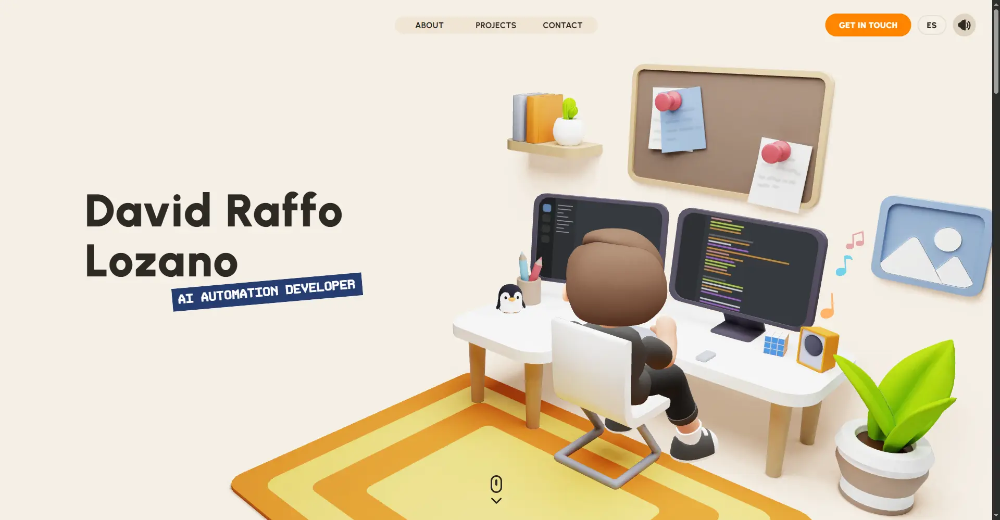

<div align="center">

# raffo.dev

**English** · [Español](README.es.md)

**Personal portfolio of David Raffo, AI Automation Developer.**
An interactive 3D website that showcases projects in process automation, AI agents and full stack development.

[](https://raffo.dev)
[](https://github.com/David-Raffo/raffo-dev-portfolio/actions/workflows/ci.yml)


<a href="https://raffo.dev"></a>

</div>

---

## Overview

[raffo.dev](https://raffo.dev) is my personal portfolio. Instead of a static list of projects, it is an interactive experience built with WebGL: a 3D room, animated scenes on scroll, sound design and a few hidden surprises, while keeping the content fast and bilingual.

## Highlights

- **Real-time 3D scenes** with three.js and custom GLSL shaders: a room with a working terminal behind the monitor, an avatar, a lab and an animated contact scene.
- **Smooth, scroll-driven motion** with GSAP and Lenis.
- **Bilingual content** in English and Spanish, with a language switcher and localized legal pages.
- **AI chatbot** powered by n8n, loaded lazily so it never slows down the first paint.
- **Sound design** with Howler, toggleable at any time.
- **Easter eggs**: a playable Tetris hidden behind the letter in the contact scene, and an interactive terminal.
- **Optimized assets**: compressed GLB models (meshopt), WebP images and code-split bundles.
- **SEO ready**: Open Graph and Twitter cards, canonical URL, `robots.txt`, privacy and legal pages.

## Featured projects

| Project | Description |
|---|---|
| **AI Shop Helper** | SaaS that automates eCommerce and digital marketing with AI agents (n8n, LangGraph, Make). |
| [**Video Tools**](https://github.com/David-Raffo/videotools) | Self-hosted browser video editor: proxy editing, Web Audio clock, WebGL2 LUT preview and full-quality FFmpeg renders. |
| [**FreeRouter**](https://github.com/David-Raffo/FreeRouter) | OpenAI-compatible router in front of 24 free inference providers, with quota tracking and automatic failover. |
| **ContextChatbot** | Self-hostable n8n chatbot for any website, in landing and RAG-powered shop versions. |
| **AI Web Apps** | [Aprende Ajedrez](https://github.com/David-Raffo/aprende-ajedrez), [Pokémon Stat Master](https://github.com/David-Raffo/pokemon-stat-master), [Qué vemos hoy](https://github.com/David-Raffo/descubre-peliculas) and [Quitafondos](https://github.com/David-Raffo/Img-background-remover), a batch background remover. |
| **Web Portfolio** | Websites delivered for clients across different industries. |

Each case study mixes real screenshots with animated, theme-aware diagrams (routing simulation, editor timeline, interactive color grading, chatbot and agent flows) built with SVG and GSAP.

## Tech stack

| Area | Technology |
|---|---|
| Framework | Vue 3 (`<script setup>`), TypeScript |
| Build | Vite 7, vue-tsc, vite-plugin-glsl |
| 3D and graphics | three.js, GLSL shaders, glTF / GLB models |
| Animation | GSAP, Lenis |
| Audio | Howler |
| Styling | SCSS with shared mixins |
| Chatbot | `@n8n/chat` |

## Getting started

Requirements: Node.js 22 or later.

```bash
git clone https://github.com/David-Raffo/raffo-dev-portfolio.git
cd raffo-dev-portfolio
npm install
npm run dev
```

The dev server runs on <http://localhost:3000>.

### Scripts

| Command | Description |
|---|---|
| `npm run dev` | Development server on port **3000** |
| `npm run build` | Type check with `vue-tsc` and build the production bundle into `dist/` |
| `npm run preview` | Serve the production build locally |
| `npm run typecheck` | Type check only |
| `npm run models` | Compress the 3D models |

### Environment variables

| Variable | Description |
|---|---|
| `VITE_SHOW_ATTRIBUTION` | Shows the original concept credit in the footer. |

## Project structure

```
src/
├── assets/          # Images, models and SCSS styles
├── components/      # Reusable UI components
├── composables/     # Vue composables
├── content/
│   ├── projects/    # Project case studies in en/ and es/
│   └── social.ts    # Social links
├── features/        # Home, projects, sounds and Tetris
├── i18n/            # Translations and language helpers
├── three/           # 3D scenes, objects and GLSL shaders
└── main.ts
public/              # Static files, meta images and legal pages
scripts/             # Model compression
```

### Adding a project

1. Create the content in `src/content/projects/en/<slug>.ts` and `src/content/projects/es/<slug>.ts`.
2. Register the slug in `projectIds` in `src/content/projects/index.ts`.
3. Add its preview in `src/content/projects/previews/`.
4. Tags and their variants live in `src/components/tagVariants.ts`.
5. Build the page from the blocks in `src/features/projects/types.ts`: `media`, `heading`, `stats`, `features`, `apps`, `marquee` and `diagram` (animated diagrams live in `src/features/projects/components/diagrams/`).

## Contact

- Website: [raffo.dev](https://raffo.dev)
- Email: [david@raffo.dev](mailto:david@raffo.dev)
- LinkedIn: [david-raf-loz](https://www.linkedin.com/in/david-raf-loz/)
- GitHub: [@David-Raffo](https://github.com/David-Raffo)

## Credits & Attribution

This project was created and designed by David Heckhoff.

If you use this project or substantial parts of its source code as a base for your own portfolio or work, attribution must be preserved.

Please keep:

- existing credit comments in the source code
- this attribution section in the README
- a visible reference to the original project/repository in derivative works

Original portfolio:
-> https://david-hckh.com

Commercial reuse or redistribution of substantial portions of this project without permission is prohibited.

Music produced by [HM Surf](https://soundcloud.com/hmsurf).

## License

Distributed under the terms described in [license.md](license.md): personal and educational use only, with attribution to the original author.
